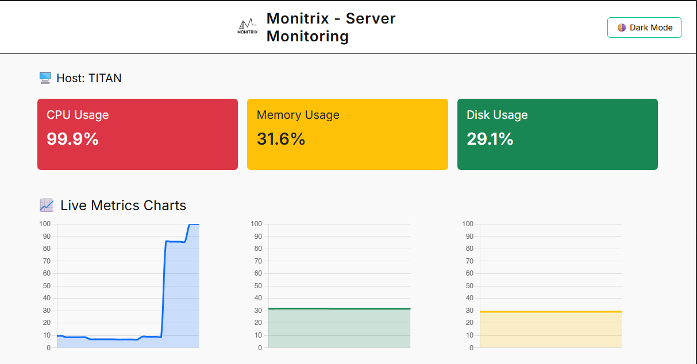
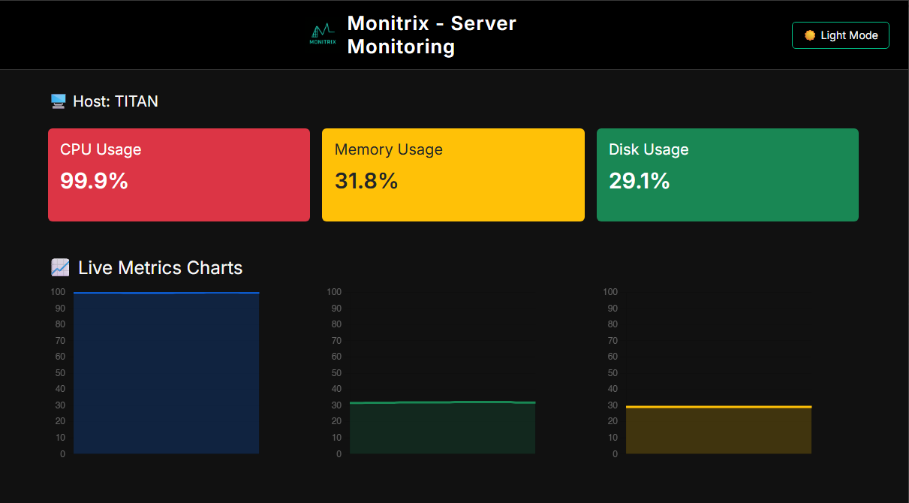

# 🖥️ Monitrix - Server Monitoring Dashboard

 


**Monitrix** is a real-time server monitoring dashboard built with FastAPI, WebSockets, and Chart.js. It features live metrics for CPU, memory, and disk usage with interactive charts, dark/light theme toggle, and responsive UI.

---

## 🔧 Features

- ✅ Real-time monitoring via WebSocket
- ✅ Light/Dark mode switch
- ✅ Animated loading spinner & hover effects
- ✅ Clean Bootstrap layout
- ✅ Live CPU, Memory, Disk charts with Chart.js

---

## 🚀 Run the Project

### 1. Clone the Repo

```bash
git clone https://github.com/silverstar33/monitrix.git
cd monitrix

2. Install Dependencies
pip install -r requirements.txt

Or manually if no requirements.txt:
pip install fastapi uvicorn psutil websockets

3. Start the Monitoring Agent
This script gathers real-time system metrics and sends them to the dashboard backend.

python monitor_agent.py
Make sure this is running on the machine you want to monitor.

4. Start the FastAPI Backend in another Terminal
uvicorn main:app --reload

Then open in browser:
📍 http://localhost:8000

🗂️ Folder Structure
bash
Copy
Edit
monitrix/
├── main.py                 # FastAPI backend
├── monitor_agent.py        # Sends real-time metrics
├── dashboard/
│   ├── dashboard.html      # Main UI
│   └── assets/             # Logos, favicon, screenshots
│       ├── logo_black.png
│       ├── logo_green.png
│       ├── favicon2.ico
│       ├── screenshot_light.png
│       └── screenshot_dark.png
├── requirements.txt
└── README.md